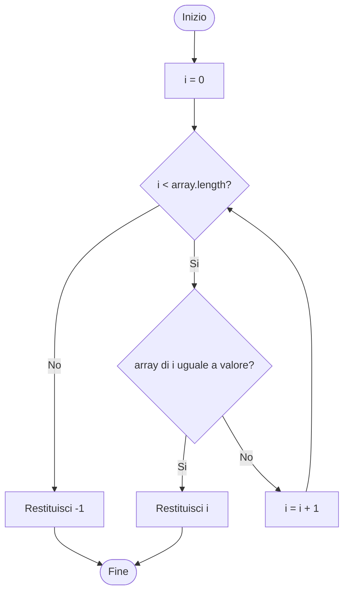

# Algoritmo di ricerca sequenziale

La ricerca sequenziale (o ricerca lineare) è un algoritmo che scorre un array dall’inizio alla fine confrontando ogni elemento con il valore cercato. Appena trova una corrispondenza restituisce l’indice di quella posizione; se arriva in fondo senza trovarla, segnala che l’elemento non è presente. È l’algoritmo più semplice per cercare un valore in un array non ordinato, già incontrato in Java.

Esempio: nell’array di voti `{7, 6, 8, 5, 9}` la ricerca del valore `8` termina all’indice `2`.

## Implementazione in Java

```java
public static int ricercaSequenziale(int[] array, int valore) {
    int i = 0;
    while (i < array.length) {
        if (array[i] == valore) {
            return i;
        }
        i = i + 1;
    }
    return -1;
}
```

Con l’input di esempio la chiamata `ricercaSequenziale(new int[]{7, 6, 8, 5, 9}, 8)` restituisce `2`.

## Diagramma di flusso

Il diagramma segue lo stesso controllo del ciclo: prima verifica se ci sono ancora elementi da esaminare, poi confronta l’elemento corrente con il valore cercato. Ci sono quindi due decisioni.



## Elemento non presente

Se il valore cercato non compare nell’array, la seconda decisione è sempre falsa. L’indice viene incrementato a ogni passo finché la prima decisione (`i < array.length`) diventa falsa. A quel punto il ciclo termina e il metodo restituisce `-1`, la convenzione usata per indicare che la ricerca non ha avuto successo. Per esempio, cercando `4` nell’array `{7, 6, 8, 5, 9}` si visitano tutti e cinque gli elementi e il risultato è `-1`.
