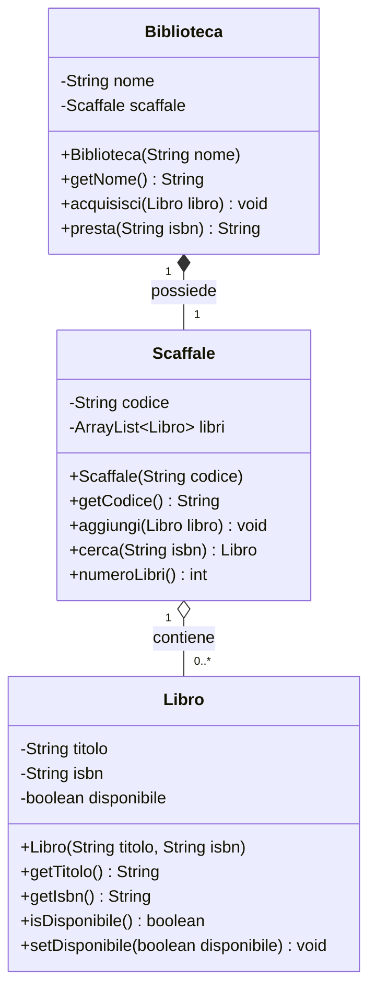
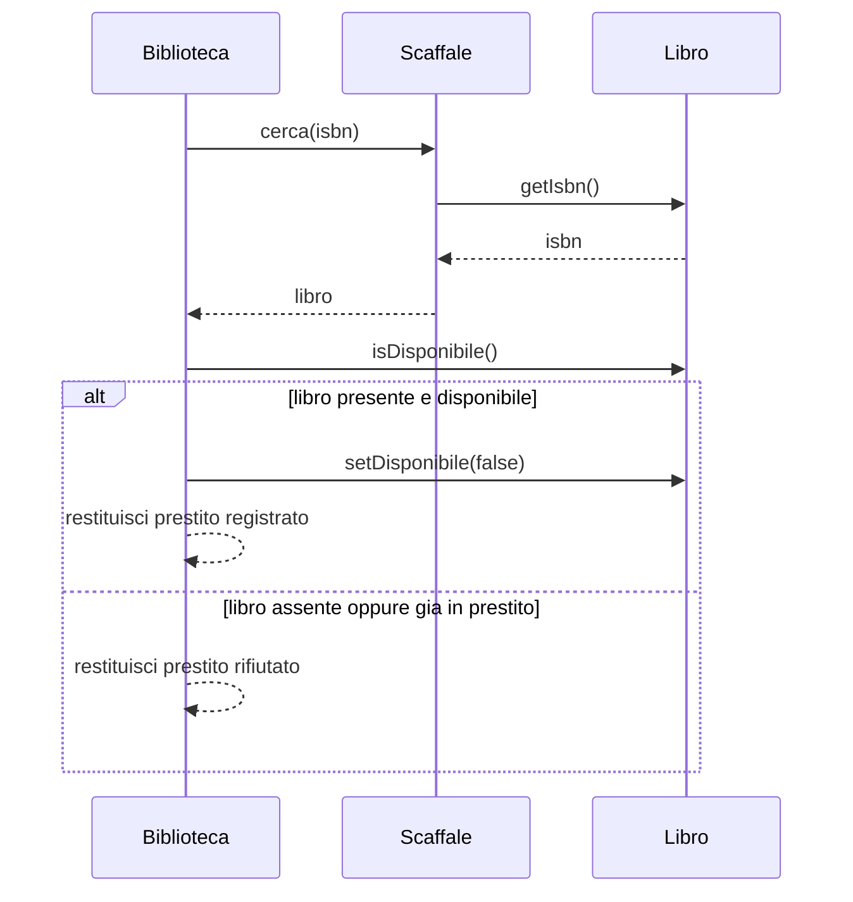

# Architettura del programma Biblioteca

Il programma documentato è una gestione minima di prestiti, nel package `biblioteca`. Le classi sono `Biblioteca`, `Scaffale` e `Libro`. Non c'è ereditarietà: le classi sono indipendenti e si conoscono solo per composizione e associazione. I sorgenti corrispondenti sono `M1_java/biblioteca/Biblioteca.java`, `M1_java/biblioteca/Scaffale.java` e `M1_java/biblioteca/Libro.java`.

## Diagramma delle classi

Il diagramma si legge partendo dai rettangoli: ogni classe elenca prima gli attributi, con `-` per la visibilità privata, poi i metodi pubblici, con `+`. `Biblioteca` tiene un solo `Scaffale`, creato nel costruttore: il rombo pieno e la molteplicità `1` a `1` indicano una composizione. `Scaffale` raccoglie da zero a molti `Libro`: il rombo vuoto e la molteplicità `0..*` indicano un'aggregazione. Non ci sono frecce di generalizzazione, perché nessuna classe estende un'altra.

## Diagramma di sequenza del prestito

L'operazione tipica è `Biblioteca.presta`. Lo scaffale cerca il libro confrontando l'ISBN; la biblioteca poi chiede se il libro è disponibile e decide il risultato.

Si legge dall'alto verso il basso, nel tempo. La freccia continua è una chiamata, la freccia tratteggiata è una risposta. I cinque scambi prima del blocco sono la ricerca e il controllo di disponibilità. Il blocco `alt` / `else` è la decisione già presente in `presta`: se `cerca` ha restituito un libro e `isDisponibile` è vero, la biblioteca lo segna come non disponibile e restituisce `prestito registrato`; altrimenti non modifica nulla e restituisce `prestito rifiutato`.
